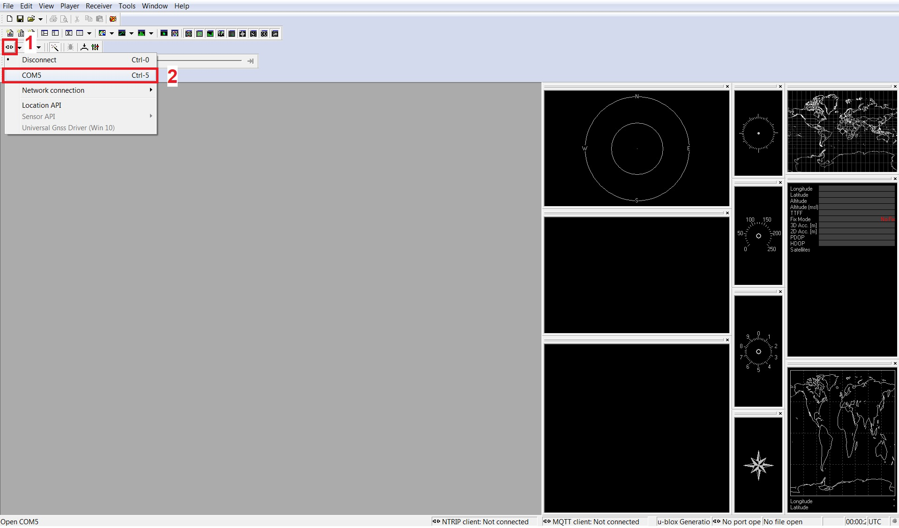
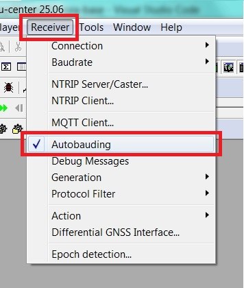
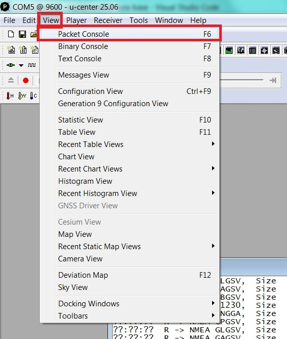
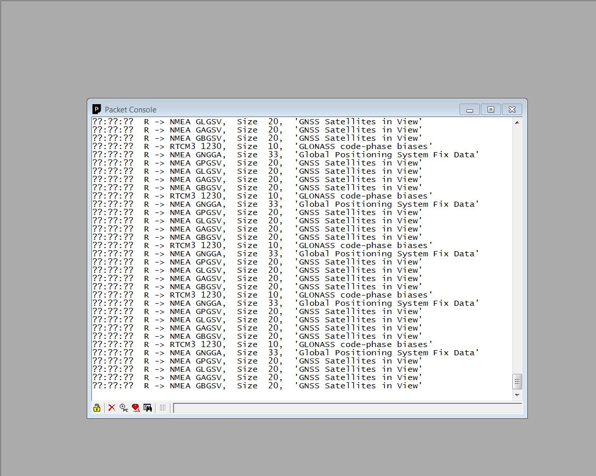
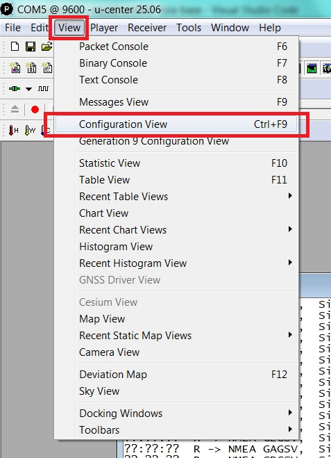
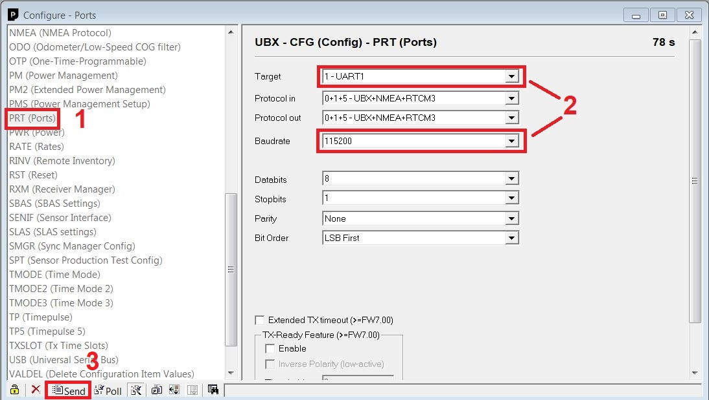
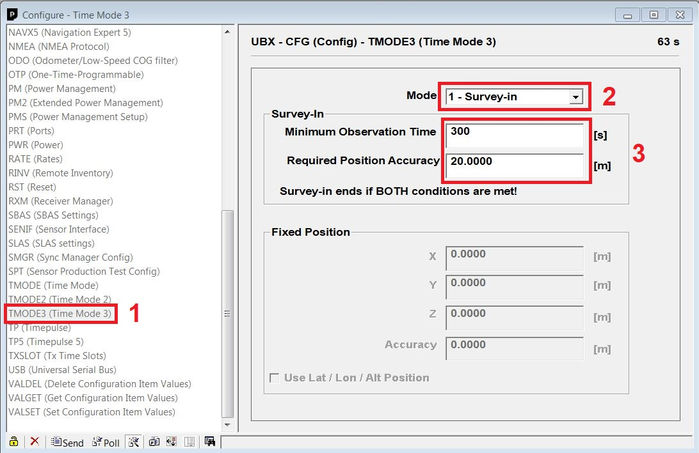
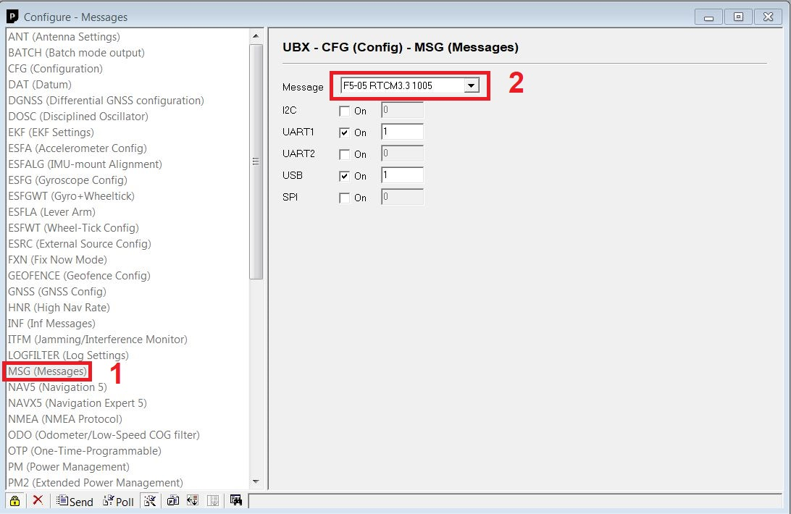

# Hướng dẫn sử dụng thiết bị Base GNSS qua 4G và Wi-Fi AITOGY-BASE-ESP

Tên thiết bị: AITOGY-GNSS-BASE-ESP

Hai mẫu chính của loại này:
- AITOGY-GNSS-BASE-ESP-UBX
- AITOGY-GNSS-BASE-ESP-UM980

## Các loại thiết bị được sử dụng:

- Module TDM2402:
    - Chip ESP32-WROOM-32E (Xử lý chính, kết nối WiFi)
    - Chip SIMCOM A7600C (Kết nối 4G)

- Module GNSS (Nhận dữ liệu GNSS, xuất dữ liệu RTCM qua UART):
    - Unicore UM980 (với mẫu AITOGY-BASESP-UM)
    - Hoặc U-Blox ZED F6P (với mẫu AITOGY-BASESP-UBX)

## Cấu hình mặc định

Đây là cấu hình mặc định của thiết bị khi xuất xưởng. Người dùng có thể thay đổi các thông số này bằng cách gửi lệnh qua Serial Monitor hoặc qua MQTT.

- Kết nối mạng: 4G (có thể chuyển sang Wi-Fi bằng lệnh `ATG ESP SET CONNECTION WIFI`)
- MQTT broker: `aitogy.asia`, cổng `1883`
- MQTT topic để ESP publish health check: `tdm2402/um980_base_001/health`
- MQTT topic được ESP subscribe để nhận lệnh: `tdm2402/um980_base_001/cmd`
- NTRIP caster: `aitogy.com.vn`, cổng `2101`
- Mountpoint: `/test`

- Nối chân cắm UART từ ESP32 đến module GNSS:
    - Với UM980:
        - IO18 (ESP32) → RX0/RX (COM1 trên mạch GNSS)
        - IO19 (ESP32) ← TX0/TX (COM1 trên mạch GNSS)
    - Với U-Blox ZED F6P:
        - IO18 (ESP32) → RX/RX1/MOSI (GNSS)
        - IO19 (ESP32) ← TX/TX1/MISO (GNSS)

## Quá trình hoạt động

Tùy theo điều kiện mạng, ESP32 sẽ mất khoảng 15 đến 20 giây để khởi động, kết nối mạng 4G, đăng nhập MQTT broker và NTRIP caster. Khi kết nối và đăng nhập thành công, ESP32 sẽ lấy dữ liệu RTCM từ module GNSS và gửi lên NTRIP caster, đồng thời gửi một bản sao của bản tin này lên một topic MQTT.

Để thông báo trạng thái sức khỏe thiết bị, mỗi 30 giây ESP32 sẽ gửi một bản tin health check lên topic MQTT đã cấu hình. Bản tin này có định dạng JSON như sau:

```json
{
    "uptime_s": 123456,
    "free_heap_bytes": 123456,
    "connected_via": "GSM",
    "rssi_dbm": "-77",
    "mqtt_ok": true,
    "ntrip_ok": true,
    "gnss_data_ok": true,
    "rtcm_types": {
        "1005": 12,
        "1074": 8,
        "1077": 10,
        "1084": 0,
        "1087": 0,
        "1094": 0,
        "1097": 0,
        "1124": 0,
        "1127": 0,
        "1230": 0
    }
}
```

## Định dạng bản tin Health Check:

- `uptime_s`: thời gian hoạt động của ESP32, tính bằng giây. Sẽ reset về 0 khi ESP32 khởi động lại.
- `free_heap_bytes`: dung lượng RAM còn trống, tính bằng byte.
- `connected_via`: phương thức kết nối mạng hiện tại, có thể là `GSM` hoặc `WIFI`.
- `rssi_dbm`: cường độ tín hiệu mạng hiện tại, tính bằng dBm.
- `mqtt_ok`: trạng thái kết nối MQTT, `true` nếu đang kết nối, `false` nếu không.
- `ntrip_ok`: trạng thái kết nối NTRIP, `true` nếu đang kết nối, `false` nếu không.
- `gnss_data_ok`: trạng thái dữ liệu GNSS, `true` nếu đang nhận dữ liệu RTCM từ module GNSS, `false` nếu không.
- `rtcm_types`: object chứa số lần xuất hiện của từng loại bản tin RTCM trong khoảng 30 giây gần nhất, tương ứng với một chu kỳ health check. Firmware hiện theo dõi các loại `1005`, `1074`, `1077`, `1084`, `1087`, `1094`, `1097`, `1124`, `1127` và `1230`. Giá trị bằng `0` nếu loại bản tin không xuất hiện trong chu kỳ hiện tại.

## Cấu hình lên ESP32:

ESP32 nhận nội dung (payload) từ Serial (nếu kết nối serial với máy tính hoặc điện thoại) hoặc qua topic lệnh MQTT đã cấu hình. Mỗi lệnh phải bắt đầu bằng `ATG`; các thành phần được ngăn cách bằng khoảng trắng. Từ khóa phân biệt chữ hoa/chữ thường. Giá trị không được chứa khoảng trắng (ví dụ mật khẩu có khoảng trắng hiện chưa được hỗ trợ).

### Cấu trúc chung

```text
ATG <NHÓM_LỆNH> <THAO_TÁC> [THAM_SỐ...]
```

Trong đó:

- `ATG`: tiền tố bắt buộc để firmware nhận diện lệnh.
- `NHÓM_LỆNH`: thành phần cần tác động: `GNSS`, `ESP`, `MQTT`, `NTRIP` hoặc `CONFIG`.
- `THAO_TÁC` và `THAM_SỐ`: phụ thuộc vào từng nhóm lệnh bên dưới.

Các lệnh `SET` lưu giá trị vào bộ nhớ Preferences (NVS) của ESP32. Khi thay đổi thông số kết nối đang hoạt động, nên khởi động lại thiết bị để các kết nối được tạo lại với cấu hình mới.

### Cấu hình liên quan tới GNSS

Các lệnh này cấu hình module GNSS ở chế độ base và được gửi qua UART đến module.

| Cú pháp | Giải thích |
| --- | --- |
| `ATG GNSS BASE SURVEY_IN <thời_gian> <độ_chính_xác>` | Bật chế độ khảo sát vị trí base. `<thời_gian>` là thời gian khảo sát tối thiểu, tính bằng giây; `<độ_chính_xác>` là ngưỡng độ chính xác, tính bằng mét. Ví dụ: `ATG GNSS BASE SURVEY_IN 300 1.0`. |
| `ATG GNSS BASE FIXED <vĩ_độ> <kinh_độ> <độ_cao> <độ_chính_xác>` | Cấu hình vị trí base cố định theo LLA. Vĩ độ và kinh độ ở đơn vị độ thập phân, độ cao và độ chính xác ở mét. Ví dụ: `ATG GNSS BASE FIXED 10.7769 106.7009 12.5 0.5`. |
| `ATG GNSS BASE <RTCM_MSG_TYPE> <PORT>` | Bật loại bản tin RTCM trên cổng GNSS chỉ định. Với Unicore dùng `COM1`, `COM2` hoặc `COM3`; với UBlox dùng `UART1`, `UART2` hoặc `USB`. Ví dụ: `ATG GNSS BASE 1074 COM2`. |
| `ATG GNSS BASE <RTCM_MSG_TYPE> <PORT>` | Bật loại bản tin RTCM trên cổng GNSS chỉ định. Với Unicore dùng `COM1`, `COM2` hoặc `COM3`; với UBlox dùng `UART1`, `UART2` hoặc `USB`. Ví dụ: `ATG GNSS BASE 1074 COM2`. |

### Cấu hình liên quan tới chính module ESP

| Cú pháp | Giải thích |
| --- | --- |
| `ATG ESP RESTART` | Khởi động lại ESP32 ngay lập tức. |
| `ATG ESP SET CONNECTION 4G` | Chuyển phương thức kết nối mạng sang 4G và khởi động lại ESP32 để áp dụng. |
| `ATG ESP SET CONNECTION WIFI` | Chuyển phương thức kết nối mạng sang Wi-Fi và khởi động lại ESP32 để áp dụng. |
| `ATG ESP SET GNSS TX <GPIO>` | Lưu chân GPIO truyền UART từ ESP32 đến GNSS. Ví dụ: `ATG ESP SET GNSS TX 17`. Không nên tự ý thay đổi cấu hình này, trừ khi là bên lập trình, sản xuất thiết bị. |
| `ATG ESP SET GNSS RX <GPIO>` | Lưu chân GPIO nhận UART từ GNSS về ESP32. Ví dụ: `ATG ESP SET GNSS RX 16`. Không nên tự ý thay đổi cấu hình này, trừ khi là bên lập trình, sản xuất thiết bị. |
| `ATG ESP SET WIFI SSID <ssid>` | Lưu tên mạng Wi-Fi cần kết nối. |
| `ATG ESP SET WIFI PASS <mật_khẩu>` | Lưu mật khẩu mạng Wi-Fi. |
| `ATG ESP SET 4G APN <apn>` | Lưu APN của nhà mạng 4G. Ví dụ: `ATG ESP SET 4G APN v-internet`. |
| `ATG ESP SET 4G USER <tên_người_dùng>` | Lưu tên người dùng APN 4G. Ví dụ: `ATG ESP SET 4G USER user`. |
| `ATG ESP SET 4G PASS <mật_khẩu>` | Lưu mật khẩu APN 4G. Ví dụ: `ATG ESP SET 4G PASS password`. |

### Cấu hình liên quan tới MQTT

| Cú pháp | Giải thích |
| --- | --- |
| `ATG MQTT SET SERVER <địa_chỉ>` | Lưu tên miền hoặc địa chỉ IP của MQTT broker. Ví dụ: `ATG MQTT SET SERVER broker.example.com`. |
| `ATG MQTT SET PORT <cổng>` | Lưu cổng MQTT (số nguyên 0–65535). Ví dụ: `ATG MQTT SET PORT 1883`. |
| `ATG MQTT SET USER <tên_người_dùng>` | Lưu tên người dùng đăng nhập MQTT. |
| `ATG MQTT SET PASS <mật_khẩu>` | Lưu mật khẩu đăng nhập MQTT. |
| `ATG MQTT SET PUBTPCHEALTH <topic>` | Lưu topic publish dữ liệu health check. Ví dụ: `ATG MQTT SET PUBTPCHEALTH tdm2402/node-01/health`. |
| `ATG MQTT SET SUBTPCCMD <topic>` | Lưu topic subscribe để nhận lệnh MQTT. Ví dụ: `ATG MQTT SET SUBTPCCMD tdm2402/node-01/cmd`. |

### Cấu hình liên quan tới NTRIP

| Cú pháp | Giải thích |
| --- | --- |
| `ATG NTRIP SET CSTRADDR <địa_chỉ>` | Lưu tên miền hoặc địa chỉ IP của NTRIP caster. |
| `ATG NTRIP SET CSTRPORT <cổng>` | Lưu cổng của NTRIP caster (số nguyên 0–65535), thường là `2101`. |
| `ATG NTRIP SET MNTPNT <mountpoint>` | Lưu mountpoint cần kết nối. Ví dụ: `ATG NTRIP SET MNTPNT VRS_RTCM32`. |
| `ATG NTRIP SET CSTRAUTH <chuỗi_xác_thực>` | Lưu chuỗi xác thực NTRIP theo định dạng base64. Giá trị này thường là base64 của `username:password`. |

### Cấu hình toàn hệ thống

| Cú pháp | Giải thích |
| --- | --- |
| `ATG CONFIG RESET` | Đánh dấu khôi phục cấu hình mặc định, sau đó khởi động lại ESP32. Lần khởi động kế tiếp sẽ xóa toàn bộ cấu hình đã lưu trong Preferences và nạp lại giá trị mặc định. |

> Lưu ý: Firmware hiện không phản hồi trạng thái lệnh qua MQTT. Theo dõi Serial Monitor để kiểm tra log xử lý lệnh; riêng lệnh GNSS sẽ báo lỗi khi thiếu hoặc thừa tham số.

## Cấu hình trực tiếp mạch GNSS

Trong một số trường hợp xảy ra lỗi (chẳng hạn lệch baud rate giữa ESP32 và GNSS), người dùng có thể cấu hình trực tiếp module GNSS bằng cách cắm serial USB vào module GNSS và sử dụng phần mềm u-center (đối với u-blox), hoặc gửi lệnh trực tiếp qua các phần mềm Serial Terminal (đối với UM98x). Các lệnh cấu hình GNSS được gửi theo định dạng văn bản thuần (với UM98x) hoặc UBX (với module GNSS của UBlox).

### U-Blox (u-center)

Người dùng có thể tải và cài đặt u-center từ [trang này](https://www.u-blox.com/en/product/u-center). Chọn U-Center (không phải U-Center 2).

Sau khi cài đặt, mở u-center, chọn đúng cổng COM nối với module GNSS để kết nối.



Có thể chọn ***Receiver > Autobauding*** để tự động dò tốc độ baud rate của module GNSS. Sau khi kết nối thành công, người dùng có thể gửi các lệnh UBX để cấu hình module GNSS.



#### Xem trực tiếp các bản tin được sinh ra từ module GNSS

Chỉ xem được nếu module GNSS đang xuất dữ liệu ra cổng COM USB. Chọn ***View > Packet Console*** để mở cửa sổ xem các bản tin UBX, NMEA và RTCM được sinh ra từ module GNSS.



Packet Console sẽ hiển thị thông tin về các bản tin được sinh ra từ module GNSS, nhưng không phải nội dung bên trong. 



Để xem nội dung bên trong, chọn ***View > Message View***. Tuy nhiên, các bản tin RTCM không phải dạng plain text đọc được.

#### Cài đặt baud rate cho từng cổng của module U-Blox

Mở ***View > Configuration View***.



Trong ***Configuration View***, chọn mục ***PRT*** để cấu hình các cổng của module GNSS. Chọn cổng cần cấu hình (UART1, UART2, USB hoặc SPI). Thay đổi tốc độ baud rate và nhấn ***Send*** để gửi lệnh cấu hình đến module GNSS.



Trong hệ thống hiện tại, UM980 được nối với ESP32 qua cổng UART1, do đó cần chọn đúng cổng này để cấu hình tốc độ baud.

#### Điều chỉnh chế độ base station cho module U-Blox

Vẫn trong ***Configuration View***, chọn tab ***TMODE3*** để cấu hình chế độ base station.

Ở mục ***Mode***, chọn chế độ base station. Có thể chọn chế độ survey-in hoặc fixed position. Nếu chọn survey-in, cần nhập thời gian khảo sát tối thiểu và ngưỡng độ chính xác (khoảng cách sai lệch tối đa).



Nếu chọn fixed position, cần nhập tọa độ, gồm: vĩ độ, kinh độ và độ cao.

Nhấn ***Send*** để gửi lệnh cấu hình đến module GNSS.

#### Cấu hình các bản tin RTCM xuất ra từng cổng của module U-Blox

Vẫn trong ***Configuration View***, chọn tab ***MSG*** để cấu hình các bản tin xuất ra từng cổng. Chọn loại bản tin RTCM cần xuất, đánh dấu các cổng (UART1, UART2, USB hoặc SPI) để xuất bản tin. Sau đó, nhấn ***Send*** để gửi lệnh cấu hình đến module GNSS.



Các bản tin có thể cấu hình cho base station bao gồm:
- F5-05: RTCM 1005
- F5-4A: RTCM 1074
- F5-4D: RTCM 1077
- F5-54: RTCM 1084
- F5-57: RTCM 1087
- F5-5E: RTCM 1094
- F5-61: RTCM 1097
- F5-7C: RTCM 1124
- F5-7F: RTCM 1127
- F5-E6: RTCM 1230

### Unicore UM98x
Người dùng có thể gửi lệnh trực tiếp qua Serial Terminal (ví dụ ***PuTTY***, ***Serial Debug Assistant***, Extension ***Serial Monitor*** của ***VSCode***, v.v.) với tốc độ baud mặc định là 38400 hoặc 115200. Các lệnh cấu hình module UM98x được gửi theo định dạng văn bản thuần (ASCII) và không phân biệt chữ hoa/chữ thường. Mỗi lệnh phải kết thúc bằng ký tự xuống dòng (LF hoặc CRLF).

#### Các cấu hình chung thường dùng

Hủy toàn bộ log ra các cổng:

```text
UNLOG ALL
```

Lưu các cấu hình cho lần khởi động kế tiếp:

```text
SAVECONFIG
```

Xóa các cấu hình đã lưu và khôi phục về mặc định:

```text
FRESET
```

#### Cấu hình baud rate cho module GNSS

Để thay đổi tốc độ baud rate của module UM98x, người dùng gửi lệnh sau:

```text
CONFIG <TÊN CỔNG> <TỐC_ĐỘ_BAUD>
```

UM980 có 3 cổng ra là `COM1`, `COM2` và `COM3`. Trong đó, `COM3` thường được các module nối ra dưới dạng cổng cắm Type-C, trong khi `COM1` và `COM2` là các cổng UART nối ra các chân GPIO của module. Tốc độ baud có thể là 9600, 19200, 38400, 57600, 115200, 230400, 460800 hoặc 921600.

#### Cấu hình chức năng base station GNSS

Để cấu hình module UM98x hoạt động ở chế độ base station và tự xác định vị trí ở chế độ survey-in, người dùng gửi lệnh sau:

```text
MODE BASE TIME <thời gian khảo sát tối thiểu> <độ sai lệch khoảng cách tối đa>
```

Ở chế độ survey-in, vị trí của base station sẽ chỉ được xác định sau khi thời gian khảo sát tối thiểu đã trôi qua và độ sai lệch khoảng cách nhỏ hơn ngưỡng tối đa đã đặt.

Nếu rút gọn lệnh thành `MODE BASE TIME <thời gian khảo sát tối thiểu>`, module sẽ sử dụng ngưỡng độ sai lệch khoảng cách mặc định là 2.5m.

Néu rút gọn lệnh thành `MODE BASE`, module sẽ sử dụng thời gian khảo sát tối thiểu mặc định là 60 giây và ngưỡng độ sai lệch khoảng cách mặc định là 2.5m.

Để cấu hình module UM98x hoạt động ở chế độ base station với vị trí cố định đã biết trước, người dùng gửi lệnh sau:

```text
MODE BASE <vĩ_độ> <kinh_độ> <độ_cao>
```

Kinh độ, vĩ độ và độ cao có thể theo định dạng GCS (hệ thống định vị địa lý) hoặc ECEF (Earth-Centered, Earth-Fixed). Khi gửi lệnh, module sẽ tự động nhận diện định dạng dựa trên giá trị của các tham số.

***Ghi chú:*** Độ cao tính theo mét.

***Ví dụ:***

```text
MODE BASE 10.7769 106.7009 12.5
```

#### Cấu hình các bản tin RTCM xuất ra từng cổng

Người dùng có thể cấu hình module UM98x xuất các bản tin RTCM ra từng cổng COM1, COM2 và COM3. Mỗi cổng có thể xuất ra nhiều loại bản tin RTCM khác nhau. Cấu hình được thực hiện bằng lệnh sau:

```text
<Loại bản tin> <COM1|COM2|COM3> <Tần suất xuất bản tin>
```

Loại bản tin bao gồm RTCM1005, 1074, 1077, 1084, 1087, 1094, 1097, 1124, 1127 và 1230. Tần suất xuất bản tin có đơn vị là Hz (số bản tin/giây).

***Ví dụ:***
```text
RTCM1005 COM1 1
```

